# Universal Device Card

[](https://github.com/hacs/integration)
[](https://github.com/n71154plus/universal-device-card/releases)

Home Assistant Lovelace **通用裝置卡片**：主畫面做常用控制；點右上角按鈕，立刻彈出**同一個實體裝置**上的其餘感測與控制項。

目前釋出版本：**v2.6.3**

## 精髓：右上角 → 同裝置彈出層

卡片右上角的按鈕（調校圖示）不是「更多資訊」而已，而是把 **Home Assistant 裡掛在同一 device 上的其它實體**一次展開：

- 左側／上方：**感測數據**（溫度、功耗、PM2.5…）
- 右側／下方：**控制項目**（開關、模式、風向、兒童鎖…）

主畫面保持乾淨；進階設定都收在彈出層，不用再翻實體清單。

| 主卡片（右上角按鈕） | 點擊後的同裝置彈出層 |
|:---:|:---:|
| 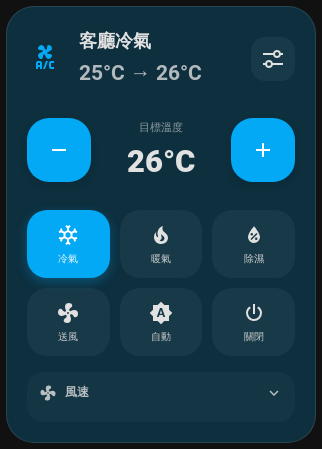 | 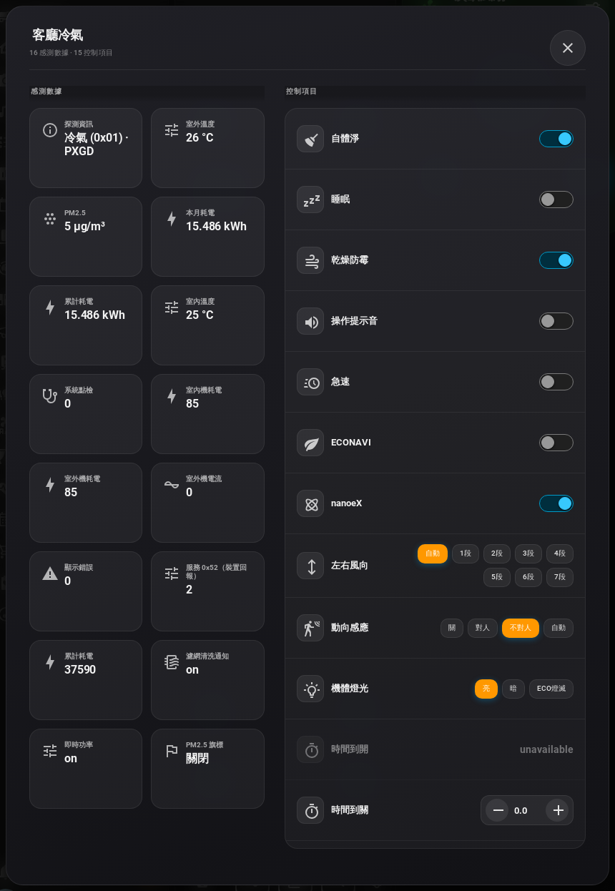 |

彈出層實際畫面（客廳冷氣：16 筆感測 · 15 項控制）：

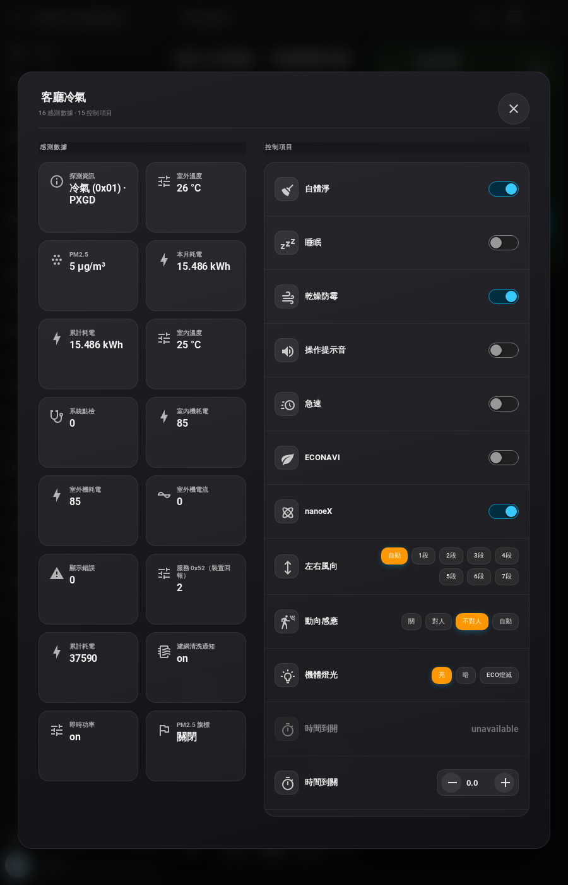

其它裝置同樣適用：

| 風扇彈出層 | 窗簾彈出層 |
|:---:|:---:|
| 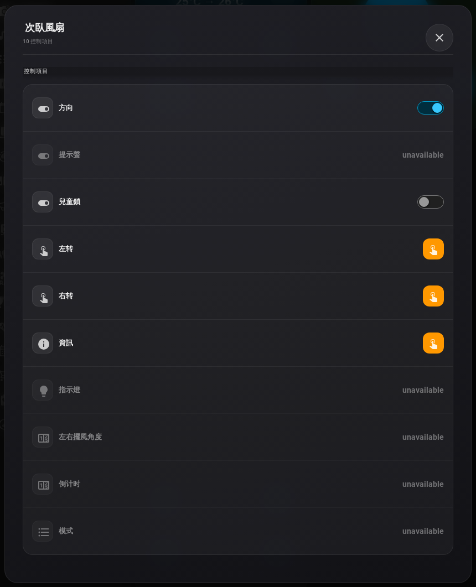 | 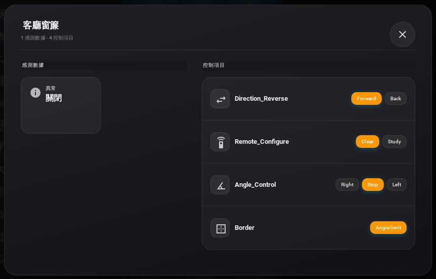 |

> 可用 `disable_popup: true` 關閉；也可用 domain／entity／sensor class 過濾器決定彈出層要顯示哪些項目。

## 預覽（實際畫面）

以下截圖皆取自真實 Home Assistant 儀表板。

### 總覽

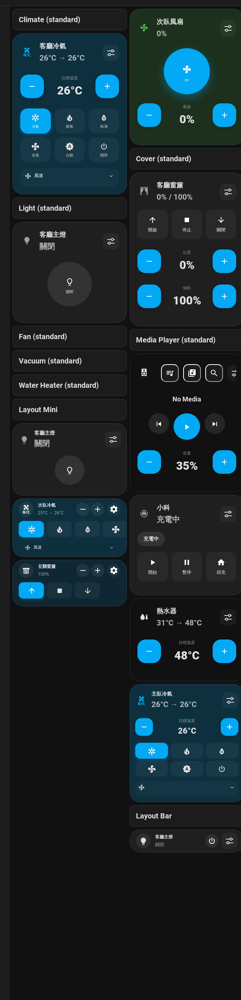

### 依裝置類型（`layout: standard`）

| Climate 冷氣 | Light 燈光 |
|:---:|:---:|
|  | 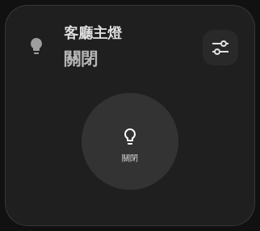 |

| Fan 風扇 | Cover 窗簾 |
|:---:|:---:|
| 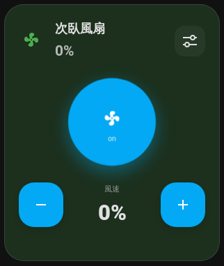 | 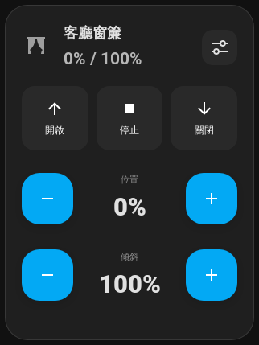 |

| Media Player 媒體 | Vacuum 掃地機 |
|:---:|:---:|
| 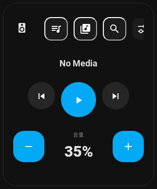 | 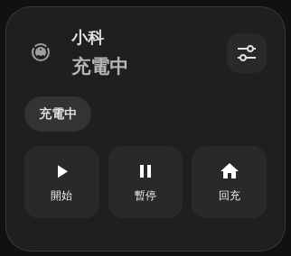 |

| Water Heater 熱水器 | |
|:---:|:---:|
| 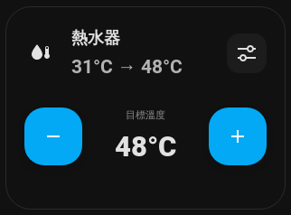 | |

### 版面模式（Layout）

| Mini | Bar |
|:---:|:---:|
| 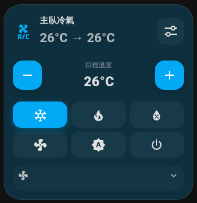 | 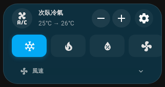 |
| 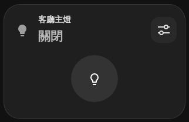 | 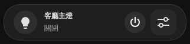 |

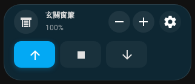

## 功能說明

- **同裝置彈出層（核心）**：右上角按鈕展開同一 device 的感測與控制；支援過濾器
- **自動適配裝置類型**：`climate`、`light`、`fan`、`cover`、`media_player`、`vacuum`、`water_heater`、`humidifier`、以及其他通用實體
- **三種版面**：`standard`（完整控制）、`mini`（精簡）、`bar`（單列長條，適合列表）
- **多語系**：`auto` / `zh-TW` / `zh-CN` / `en` / `ja`
- **效能選項**：`animations`、`performance_mode`（關閉動畫）

## 透過 HACS 安裝（推薦）

1. 確認已安裝 [HACS](https://hacs.xyz/)
2. HACS → **前端** → 右上角 **⋮** → **自訂儲存庫**
3. 新增：
   - **URL**：`https://github.com/n71154plus/universal-device-card`
   - **類型**：Dashboard（Lovelace）
4. 在清單找到 **Universal Device Card** → 下載／安裝
5. 重新載入 Home Assistant 前端
6. 儀表板 → 新增卡片 → 選擇 **Universal Device Card**

HACS 資源路徑（通常會自動加入）：

```text
/hacsfiles/universal-device-card/universal-device-card.js
```

類型請選 **JavaScript Module**。

## 手動安裝

1. 下載最新 [Release](https://github.com/n71154plus/universal-device-card/releases) 的 `dist/`（需含 `universal-device-card.js` 與 `translations/`）
2. 放到 `config/www/universal-device-card/`
3. Lovelace 資源新增：

```text
/local/universal-device-card/universal-device-card.js
```

類型：JavaScript Module。

## 設定教學

### 最簡設定

```yaml
type: custom:universal-device-card
entity: climate.living_room
```

點右上角按鈕即可開啟該裝置彈出層。

### 完整範例

```yaml
type: custom:universal-device-card
entity: climate.living_room
layout: standard          # standard | mini | bar
language: zh-TW           # auto | en | zh-TW | zh-CN | ja
disable_popup: false      # true = 關閉同裝置彈出層
animations: true
performance_mode: false
show_buttons:
  - button.ac_eco
  - button.ac_sleep
```

### 彈出層過濾（可選）

只保留你想在彈出層看到的項目：

```yaml
type: custom:universal-device-card
entity: climate.living_room
exclude_domains: binary_sensor,button
include_domains: sensor,switch,select,number
exclude_entities: sensor.ac_debug
include_sensor_classes: temperature,humidity,power,pm25
```

### 選項一覽

| 選項 | 預設 | 說明 |
|------|------|------|
| `entity` | （必填） | 主要裝置實體 ID |
| `layout` | `standard` | 版面：`standard` / `mini` / `bar` |
| `language` | `auto` | 介面語言；`auto` 跟隨 HA |
| `disable_popup` | `false` | 停用右上角同裝置彈出層 |
| `animations` | `true` | 啟用動畫 |
| `performance_mode` | `false` | 效能模式（關閉動畫） |
| `show_buttons` | `[]` | 主畫面顯示的 button 實體列表 |
| `exclude_domains` | | 彈出層排除的 domain |
| `include_domains` | | 彈出層只顯示這些 domain |
| `exclude_entities` | | 彈出層排除的實體 ID |
| `include_entities` | | 彈出層只顯示這些實體 ID |
| `exclude_sensor_classes` | | 排除的 sensor device_class |
| `include_sensor_classes` | | 只包含的 sensor device_class |

更多說明見 [info.md](info.md)。

## 開發與建置

- HACS／Release 以 `dist/` 為準（含 JS 與 `translations/`）
- `src/` 為模組化原始碼參考
- 從模組重建：`npm install && npm run build`（會覆寫 `dist/`）

## 授權

MIT
